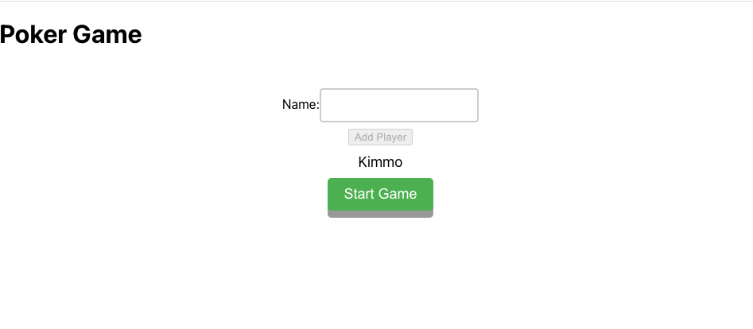
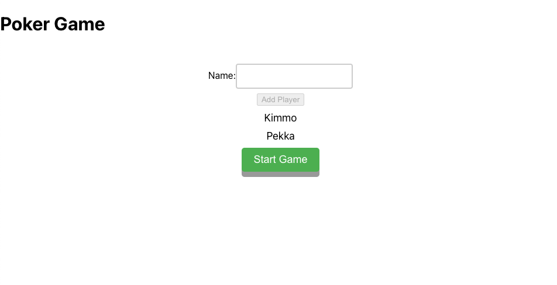
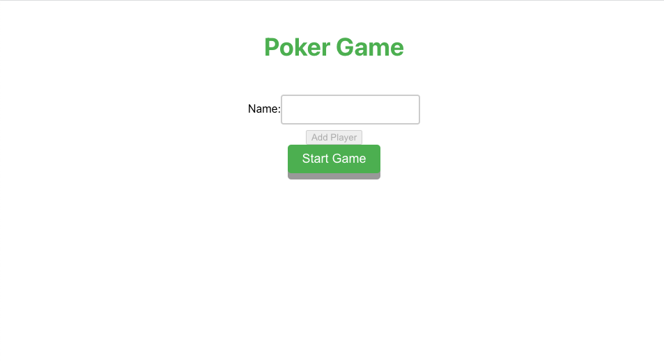

# Pair coding with ChatGPT

This was an attempt to create a poker game using ChatGPT. I didn't have any clear specs of the game in mind.

You can check the full conversion in [chat.pdf](chat.pdf). I also exported the page html as [chat.html](chat.html) but it didn't look very nice without extra effort (maybe someone has already created a tool that converts Thread div to a nice looking output?).

### Learnings

* It understood the text input incredibly well. I purposely wrote bad grammar and it almost always understood what I meant. Also typos weren't a problem. I referred to the earlier "NamePropmt" (typo) and it understood I was talking about the "NamePrompt" component.

* It didn't feel awkward to refer to things we chatted about previously

* Providing corrections to code worked well.

* Combining pieces of code worked surprisingly well. It seemed to use the correct APIs and types of components it had created before.

* Iterating on aspects that touched the code widely was difficult, partly due to the limited maximum reply length.

* It got each card in the poker deck right. This would be super useful to e.g. write a strict union type of all the cards etc without doing manual tedious work.


### Short summary

First version

<video src="docs/demo1.mov" controls="controls" style="max-width: 730px;"></video>

Second version

<video src="docs/demo2.mov" controls="controls" style="max-width: 730px;"></video>

After asking it to improve the visual look





I asked

> do these changes to the css: center the header, make it the same color as start button, add whitespace between name label and input field, add margins between add players and start game buttons




After that it had got the main menu and player adding screens done. And we moved to the game itself.

I just asked a vague:

> now let's focus on the game itself. can you create a Game component which runs the poker game

and it replied with a rough poker game component skeleton.

> ok add all the poker deck cards initially to the deck and show the player cards as nicer components

then it replied with a code that looked to be correctly initialising the deck:


```typescript
const deck: string[] = [
  "A♠",
  "2♠",
  "3♠",
  "4♠",
  "5♠",
  "6♠",
  "7♠",
  "8♠",
  "9♠",
  "10♠",
  "J♠",
  "Q♠",
  "K♠",
  "A♥",
  "2♥",
  "3♥",
  "4♥",
  "5♥",
  "6♥",
  "7♥",
  "8♥",
  "9♥",
  "10♥",
  "J♥",
  "Q♥",
  "K♥",
  "A♣",
  "2♣",
  "3♣",
  "4♣",
  "5♣",
  "6♣",
  "7♣",
  "8♣",
  "9♣",
  "10♣",
  "J♣",
  "Q♣",
  "K♣",
  "A♦",
  "2♦",
  "3♦",
  "4♦",
  "5♦",
  "6♦",
  "7♦",
  "8♦",
  "9♦",
  "10♦",
  "J♦",
  "Q♦",
  "K♦",
];
```

but the code was too long to output.
